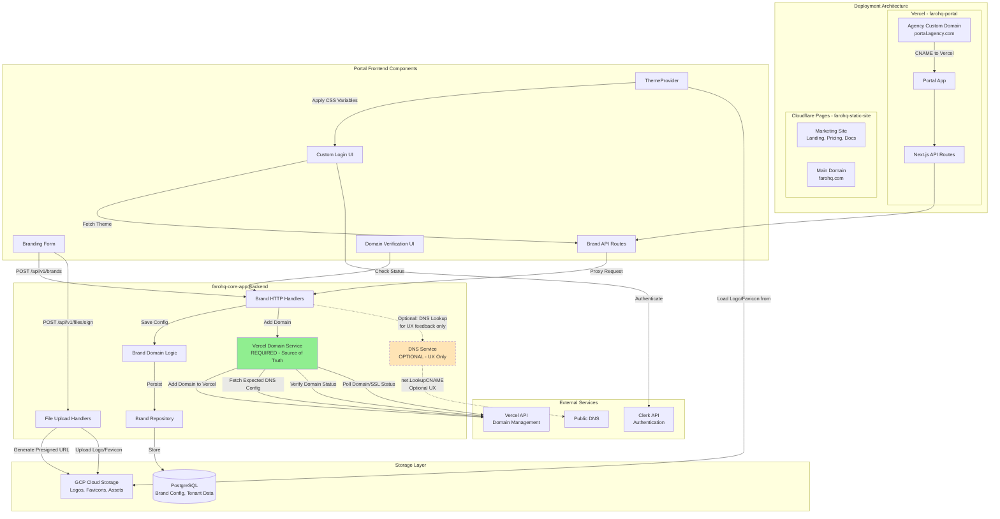
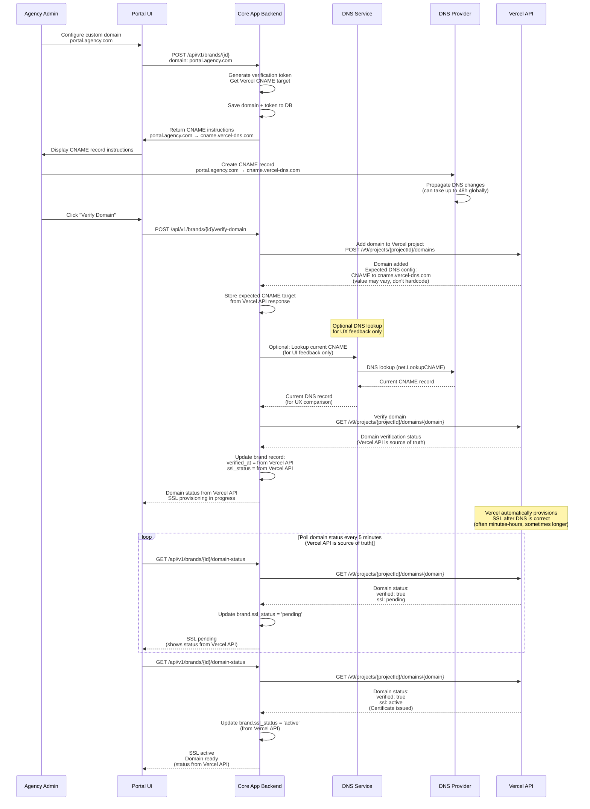

# White-Label Branding Implementation Plan

## Overview

This plan implements the complete white-label branding feature (A2) across farohq-core-app (backend) and farohq-portal (frontend). The implementation includes logo uploads, brand colors, custom domain verification, tier-based branding controls, and a fully custom authentication UI.

## Architecture Overview

### Deployment Architecture Details

**Vercel (farohq-portal)**:

- **Purpose**: Customer/agency portal with authentication, dashboard, and white-label branding
- **Custom Domains**: Agencies point `portal.agency.com` → Vercel deployment
- **SSL**: Vercel automatically provisions SSL certificates for custom domains (within 24h)
- **Domain Verification**: Backend verifies DNS CNAME records before enabling domain
- **API Routes**: Next.js API routes proxy to backend (farohq-core-app)

**Cloudflare Pages (farohq-static-site)**:

- **Purpose**: Marketing/public site (landing pages, pricing, docs, blog)
- **Domain**: Main FaroHQ domain (farohq.com, www.farohq.com)
- **Separate**: Independent deployment, not involved in white-label branding

**GCP Cloud Storage**:

- **Purpose**: Long-term persistent storage for brand assets (logos, favicons)
- **Integration**: Backend generates presigned URLs for direct client uploads
- **CDN**: GCS public URLs can be served via CDN (Cloud CDN or Cloudflare)
- **Tenant Isolation**: Assets stored with tenant_id in path: `gs://bucket/{tenant_id}/branding/logo.png`

### CNAME Integration Flow

## Deployment Architecture & CNAME Integration

### Overview

The white-label branding feature supports agencies configuring custom domains (e.g., `portal.agency.com`) that point to the portal deployment on Vercel. Vercel automatically handles SSL provisioning, while the backend manages domain verification and brand theme application.

### Deployment Components

1. **farohq-portal (Vercel)**:

   - Next.js 14 application deployed on Vercel
   - Handles agency custom domains via Vercel's custom domain feature
   - Serves white-labeled UI based on domain → brand resolution
   - API routes proxy to backend (farohq-core-app)

2. **farohq-static-site (Cloudflare Pages)**:

   - Marketing/public site (landing pages, pricing, docs, blog)
   - Deployed separately on Cloudflare Pages
   - NOT involved in white-label branding (agencies don't point custom domains here)
   - Uses main FaroHQ domain (farohq.com)

3. **farohq-core-app (GCP Cloud Run)**:

   - Go backend service handling brand management, file storage, domain verification
   - Manages brand configuration, logo/favicon storage (GCS), domain verification
   - Integrates with Vercel API for domain management

### CNAME Integration Flow

**Step 1: Agency Configuration**

- Agency admin configures custom domain in portal settings: `portal.agency.com`
- Backend generates CNAME instructions with target: `cname.vercel-dns.com` (or Vercel-provided target)
- Instructions displayed in UI for agency DNS administrator

**Step 2: DNS Configuration**

- Agency DNS administrator creates CNAME record: `portal.agency.com → cname.vercel-dns.com`
- DNS propagation begins (can take up to 48h globally)

**Step 3: Domain Verification**

- Agency clicks "Verify Domain" in portal UI
- Backend DNS service checks CNAME record using standard DNS lookup
- If CNAME verified, backend calls Vercel API to add domain to Vercel project
- Backend updates brand record: `verified_at = now()`, `ssl_status = 'pending'`

**Step 4: SSL Provisioning (Automatic)**

- Vercel automatically detects new domain and starts SSL certificate provisioning
- SSL provisioning is asynchronous and takes up to 24h
- Backend polls Vercel API to check SSL status periodically
- When SSL is active, backend updates: `ssl_status = 'active'`
- Agency receives notification that domain is ready

**Step 5: Brand Theme Application**

- When user visits `portal.agency.com`, portal middleware resolves domain to brand
- Portal fetches brand theme via `/api/v1/brand/by-host?host=portal.agency.com`
- Brand theme (logo, colors) applied via CSS variables
- White-labeled UI served with agency branding

### Why Vercel for Portal, Cloudflare for Static Site?

- **Portal on Vercel**: Better Next.js integration, automatic SSL, easy custom domain management, SSR/ISR support
- **Static Site on Cloudflare Pages**: Cost-effective for static content, global CDN, fast edge delivery, separate deployment pipeline
- **Separation of Concerns**: Portal handles authenticated/dynamic content, static site handles marketing/public content

## Implementation Phases

### Phase 1: Backend - Enhanced Brand Management

#### 1.1 Database Schema Updates

**File**: `migrations/YYYYMMDDHHMM_add_branding_features.up.sql`

- Add `hide_powered_by` boolean field to `branding` table (default false)
- Add `website` TEXT field to `branding` table (nullable, optional - captured during onboarding for all tiers if available)
  - Store agency website URL (e.g., https://agency.com) for future custom domain integration
  - Optional field: Some agencies (especially solopreneurs) may not have a website yet
  - Used for early redirection and custom domain setup when tier upgrades to Scale
  - Can be added during onboarding OR later in brand settings
- Add `subdomain` TEXT field to `branding` table (nullable, generated for lower tiers)
  - Format: `{agency-slug}.portal.farohq.com` (e.g., `agency-a.portal.farohq.com`)
  - Generated automatically for Starter and Growth tiers during onboarding
  - Scale tier: Can use custom domain OR subdomain (flexibility)
- Add `domain_type` TEXT field to `branding` table ('subdomain', 'custom', NULL)
  - 'subdomain': Lower tiers using `{slug}.portal.farohq.com`
  - 'custom': Scale tier using custom domain via Vercel
  - NULL: Not configured yet
- Add `email_domain` TEXT field to `branding` table (nullable, separate from A2 but useful)
- Add `cloudflare_zone_id` TEXT field for domain verification tracking (for custom domains only)
- Add `domain_verification_token` TEXT field for DNS verification (for custom domains only)
- Add `ssl_status` TEXT field ('pending', 'active', 'failed') (for custom domains only)
- Add index on `subdomain` for fast subdomain lookups: `CREATE INDEX idx_branding_subdomain ON branding(subdomain)`
- Update indexes for new fields

#### 1.2 Brand Domain Model Updates

**File**: `internal/domains/brand/domain/model/branding.go`

- Add `Website()` and `SetWebsite()` methods for agency website URL
- Add `Subdomain()` and `SetSubdomain()` methods for generated subdomain
- Add `DomainType()` and `SetDomainType()` methods ('subdomain', 'custom', NULL)
- Add `HidePoweredBy()` and `SetHidePoweredBy()` methods
- Add domain verification fields getters/setters (for custom domains only)
- Add `VerifyDomain()` method to update verification status (custom domains only)
- Add `GenerateSubdomain(agencySlug string) string` method
  - Generate subdomain: `{slugified-agency-slug}.portal.farohq.com`
  - Ensure slug is URL-safe (lowercase, alphanumeric + hyphens)
  - Validate subdomain uniqueness
- Update `NewBranding` and `NewBrandingWithID` constructors to include website, subdomain, domain_type
- Update domain resolution logic:
  - If `domain_type == 'custom'`: Use `domain` field (custom domain via Vercel)
  - If `domain_type == 'subdomain'`: Use `subdomain` field (`{slug}.portal.farohq.com`)
  - Both resolve to same brand but via different paths

#### 1.3 Vercel Domain Management Service (REQUIRED - Source of Truth)

**File**: `internal/domains/brand/infra/vercel/service.go` (new)

- Create VercelService struct with Vercel API client
- **Vercel API is the source of truth** for all domain operations
- Implement `AddDomainToProject(domain, projectID)` - add custom domain to Vercel project
  - Returns expected DNS configuration (CNAME target) from Vercel API response
  - Do NOT hardcode CNAME target - fetch from Vercel API (value may vary)
- Implement `GetExpectedDNSConfig(domain, projectID)` - fetch expected DNS configuration from Vercel API
  - Returns CNAME target and other DNS records required by Vercel
  - This is used to display instructions to agency
- Implement `VerifyDomain(domain, projectID)` - verify domain via Vercel API
  - Uses Vercel API endpoint to check domain verification status
  - Vercel API is authoritative for verification status
- Implement `GetDomainStatus(domain, projectID)` - get full domain status from Vercel API
  - Returns domain verification status, SSL status, and other metadata
  - Poll this endpoint to check readiness
- Implement `GetSSLStatus(domain, projectID)` - check SSL certificate status via Vercel API
  - Vercel automatically provisions SSL after DNS is correct and propagated
  - SSL provisioning time varies (often minutes-hours, sometimes longer)
- Implement `RemoveDomain(domain, projectID)` - remove domain from Vercel project
- Implement `ListDomains(projectID)` - list all domains for a project
- Handle Vercel API authentication (using VERCEL_API_TOKEN)
- Handle rate limiting and retries for Vercel API (30 req/s per token)
- Use Vercel API endpoints:
  - `POST /v9/projects/{projectId}/domains` - Add domain
  - `GET /v9/projects/{projectId}/domains/{domain}` - Get domain status (verification, SSL)
  - `DELETE /v9/projects/{projectId}/domains/{domain}` - Remove domain
  - `GET /v9/projects/{projectId}/domains` - List domains

#### 1.4 DNS Verification Service (OPTIONAL - UX Feedback Only)

**File**: `internal/domains/brand/infra/dns/service.go` (new)

- Create DNSService struct for optional DNS lookup (UX feedback only)
- **DNS lookups are optional** - only used to provide better UI feedback
- **Vercel API is the source of truth** - never use DNS lookups for verification decisions
- Implement `LookupCNAME(domain)` - perform optional DNS lookup using `net.LookupCNAME`
  - Returns current CNAME record from DNS
  - Used to compare with expected CNAME target (from Vercel API) for UX feedback
  - Helps show "DNS record looks correct" vs "DNS record not found" in UI
- Implement `CheckDNSPropagation(domain, expectedTarget)` - verify DNS changes have propagated
  - Optional helper for UI feedback
  - Shows progress indicator while DNS propagates
- Handle DNS lookup errors gracefully (don't block verification flow)
- Note: DNS propagation can take up to 48h globally, but Vercel will verify once DNS is correct

#### 1.5 Domain Verification Use Case

**File**: `internal/domains/brand/app/usecases/verify_domain.go` (new)

- Create VerifyDomain use case
- **Tier Validation (CRITICAL - FIRST CHECK)**:

  1. Get tenant/agency tier from database (join with agencies/tenants table)
  2. Check if tier supports custom domains: `TierSupportsCustomDomain(tier)`
  3. If tier is not Scale, return error: "Custom domain support is only available for Scale tier"
  4. Only proceed with domain verification if tier is Scale

- **Primary flow (required)**: Use VercelService as source of truth (Scale tier only)

  1. Call VercelService.AddDomainToProject() to add domain to Vercel project (only for Scale tier)
  2. Fetch expected DNS configuration from Vercel API (CNAME target - don't hardcode)
  3. Store expected CNAME target in database for displaying instructions
  4. Call VercelService.VerifyDomain() to check verification status via Vercel API
  5. Poll VercelService.GetDomainStatus() to check domain/SSL readiness
  6. Update brand verification fields based on Vercel API response (verified_at, ssl_status)

- **Optional flow (UX only)**: Use DNSService for UI feedback

  1. Optionally call DNSService.LookupCNAME() to show current DNS record in UI
  2. Compare current DNS record with expected CNAME target (from Vercel API) for UX feedback
  3. Show helpful messages like "DNS record looks correct" or "DNS record not found yet"
  4. Never use DNS lookup result for verification decisions - only for UI feedback

- Vercel automatically provisions SSL after DNS is correct and propagated
- SSL provisioning time varies (often minutes-hours, sometimes longer)
- Poll Vercel API for SSL status rather than DNS lookups

#### 1.6 Update Brand Use Case Enhancement (with Tier Validation)

**File**: `internal/domains/brand/app/usecases/update_brand.go`

- Add support for `hide_powered_by` field with tier validation
  - Check tier before allowing hide_powered_by update
  - Only Growth+ tiers can hide "Powered by Faro" badge
  - Reject update if tier is Starter and hide_powered_by is true
- Add support for `domain` field with tier validation
  - **Tier validation (CRITICAL)**: Check if tenant tier is Scale before allowing domain updates
  - If tier is not Scale and domain is provided, return error: "Custom domain support is only available for Scale tier"
  - If tier is Scale, allow domain configuration
  - If domain changes and tier is Scale, reset verification status (verified_at = null, ssl_status = 'pending')
  - If tier is not Scale and domain exists in brand, clear domain field (prevent domain config for lower tiers)
- Integrate with DNS verification and Vercel services (only for Scale tier)
- Get tenant tier from context (join with agencies/tenants table) before processing updates

#### 1.7 Brand Creation Use Case (Onboarding)

**File**: `internal/domains/brand/app/usecases/create_brand.go` (update)

- **Capture agency website during onboarding** (optional, regardless of tier)
  - Accept `website` field in CreateBrandRequest (optional - can be null/empty)
  - Store website URL in brand record if provided (for future custom domain integration)
  - Validate website URL format only if provided (must be valid URL if not empty)
  - Allow null/empty website: Some agencies (especially solopreneurs) may not have a website yet
  - Website can be added later in brand settings if not provided during onboarding
- **Generate subdomain for lower tiers** (Starter, Growth)
  - Check tier before creating brand
  - If tier is Starter or Growth: Generate subdomain using `GenerateSubdomain(agencySlug)`
  - Set `domain_type = 'subdomain'` and `subdomain = '{slug}.portal.farohq.com'`
  - Set `domain = NULL` (no custom domain for lower tiers)
  - Store website for future use (when they upgrade to Scale)
- **Scale tier**: Allow custom domain OR subdomain
  - If custom domain provided: Set `domain_type = 'custom'` and use Vercel integration
  - If no custom domain: Generate subdomain as fallback (`domain_type = 'subdomain'`)
  - Store website for custom domain setup when ready
- **Subdomain generation**:
  - Use agency slug from tenant (already slugified during tenant creation)
  - Format: `{slug}.portal.farohq.com` (decided: portal.farohq.com is better than app.farohq.com)
  - Ensure subdomain uniqueness (check for conflicts)
  - Handle slug conflicts by appending number if needed: `{slug}-2.portal.farohq.com`

#### 1.8 File Upload Integration

**File**: `internal/domains/brand/app/usecases/update_brand.go`

- Enhance to accept file uploads directly (or keep separate flow)
- Ensure logo/favicon URLs are validated and accessible (must be GCS public URLs)
- Support PNG/SVG format validation
- Logo/favicon URLs stored as GCS public URLs (gs://bucket/path or https://storage.googleapis.com/bucket/path)

#### 1.9 Brand Repository Updates

**File**: `internal/domains/brand/infra/db/brand_repository.go`

- Add methods to update new fields (hide_powered_by, verification fields, ssl_status, website, subdomain, domain_type)
- Add query to get brand by `subdomain` (for subdomain-based resolution)
  - `FindBySubdomain(ctx, subdomain)` - used when resolving brand from `{slug}.portal.farohq.com`
- Add query to get brand by `domain` (for custom domain resolution)
  - `FindByDomain(ctx, domain)` - used when resolving brand from custom domain
- Update `FindByHost(ctx, host)` to handle both subdomain and custom domain:
  - If host is `*.portal.farohq.com`: Extract subdomain and query by subdomain
  - If host is custom domain: Query by domain field
  - Return appropriate brand based on domain_type
- Add query to get brand by agency_id with tier join (for tier-based features)
- Add query to check subdomain uniqueness: `CheckSubdomainExists(ctx, subdomain)`
- Add query to update domain verification status
- Add query to update SSL status
- Add query to update website (for future custom domain integration)
- Ensure tenant isolation on all queries (RLS policies)

#### 1.10 HTTP Handlers Updates

**File**: `internal/domains/brand/infra/http/handlers.go`

- Update `CreateBrandHandler` to accept `website` field (optional during onboarding)
  - Accept `website` in request body (agency website URL, optional)
  - Capture website if provided (for future custom domain integration)
  - Allow null/empty website: Some agencies may not have a website yet
  - Validate website URL format only if provided (must be valid URL if not empty)
  - Generate subdomain automatically for lower tiers (Starter, Growth)
  - For Scale tier: Allow custom domain OR generate subdomain as fallback
  - Return brand with appropriate domain configuration (subdomain or custom domain)
  - Website can be added later in brand settings if not provided during onboarding
- Update `UpdateBrandHandler` to accept `hide_powered_by` field, `domain` field, and `website` field
  - **Tier validation**: Check tier before allowing domain updates
  - If tier is not Scale and domain is provided, return error: "Custom domain support is only available for Scale tier"
  - If tier is Scale, allow domain configuration (custom domain)
  - If tier upgrades from lower tier to Scale: Allow custom domain setup (use stored website)
  - Validate tier for hide_powered_by (Growth+ tiers only)
  - Allow website updates at any time (for future custom domain integration)
- Add `VerifyDomainHandler` endpoint `POST /api/v1/brands/{brandId}/verify-domain`
  - **Tier validation (FIRST)**: Check if tenant tier is Scale
  - If tier is not Scale, return 403 Forbidden: "Custom domain support is only available for Scale tier"
  - Only proceed if tier is Scale
  - Calls VercelService to add domain to Vercel project (if not already added)
  - Fetches expected DNS configuration from Vercel API (CNAME target - don't hardcode)
  - Calls VercelService.VerifyDomain() to check verification status (Vercel API is source of truth)
  - Optionally performs DNS lookup for UX feedback (current CNAME record)
  - Returns verification status and expected CNAME target from Vercel API
- Add `GetDomainStatusHandler` endpoint `GET /api/v1/brands/{brandId}/domain-status`
  - **Tier validation**: Check if tenant tier is Scale
  - If tier is not Scale, return 403 Forbidden with tier upgrade message
  - Polls Vercel API for full domain status (verification, SSL readiness)
  - Returns domain verification status, SSL status, and metadata from Vercel API
  - This is the authoritative status endpoint
- Add `GetDomainInstructionsHandler` endpoint `GET /api/v1/brands/{brandId}/domain-instructions`
  - **Tier validation**: Check if tenant tier is Scale
  - If tier is not Scale, return 403 Forbidden with tier upgrade message
  - Fetches expected DNS configuration from Vercel API (CNAME target and other records)
  - Returns CNAME record instructions for agency to configure in their DNS
  - Do NOT hardcode CNAME target - always fetch from Vercel API
- Add `GetSSLStatusHandler` endpoint `GET /api/v1/brands/{brandId}/ssl-status`
  - **Tier validation**: Check if tenant tier is Scale
  - If tier is not Scale, return 403 Forbidden with tier upgrade message
  - Polls Vercel API for SSL certificate status (Vercel API is source of truth)
  - Returns current SSL status (pending, active, failed) from Vercel API
  - Vercel automatically provisions SSL after DNS is correct and propagated
- Ensure proper error handling and tenant validation
- All domain-related endpoints must validate tier before processing

#### 1.11 Brand Router Updates

**File**: `internal/domains/brand/infra/http/router.go`

- Add new routes:
  - `POST /api/v1/brands/{brandId}/verify-domain` - Verify domain via Vercel API (source of truth, Scale tier only)
  - `GET /api/v1/brands/{brandId}/domain-status` - Get full domain status from Vercel API (authoritative, Scale tier only)
  - `GET /api/v1/brands/{brandId}/ssl-status` - Get SSL status from Vercel API (Scale tier only)
  - `GET /api/v1/brands/{brandId}/domain-instructions` - Get DNS instructions (CNAME target from Vercel API, Scale tier only)
  - `GET /api/v1/brands/by-subdomain?subdomain={subdomain}` - Get brand by subdomain (for subdomain resolution)
- Add middleware for tenant context validation
- Ensure all routes respect tenant isolation
- Domain-related routes (verify-domain, domain-status, etc.) only work for Scale tier (returns 403 for lower tiers)

#### 1.12 Get Brand by Host/Domain (Domain Resolution)

**File**: `internal/domains/brand/app/usecases/get_by_host.go` (update)

- Update host resolution logic to handle both subdomain and custom domain:
  - Parse host to determine type:
    - If host ends with `.portal.farohq.com`: Extract subdomain, query by subdomain
    - If host is custom domain: Query by domain field
  - Return brand with appropriate domain configuration
  - Handle both `domain_type == 'subdomain'` and `domain_type == 'custom'`
  - Join with agencies/tenants table to get tier information

**File**: `internal/domains/brand/app/usecases/get_brand.go` (update)

- Join with agencies/tenants table to get tier information
- Apply tier-based rules for "Powered by Faro" badge:
  - Growth+ tiers (growth, scale) can hide "Powered by Faro"
  - Starter tier cannot hide "Powered by Faro" badge
  - Return `can_hide_powered_by` boolean in response (based on tier)
  - Only return `hide_powered_by` as true if tier allows it (even if stored as true)
- Apply tier-based rules for custom domain support:
  - **Scale tier only** can configure custom domains (enterprise feature)
  - Starter and Growth tiers cannot configure custom domains
  - Return `can_configure_domain` boolean in response (true only for scale tier)
  - Return `subdomain` field for lower tiers (e.g., `agency-a.portal.farohq.com`)
  - Return `website` field (always present, used for custom domain integration when tier upgrades)
  - Return `domain_type` field ('subdomain', 'custom', NULL)
  - If tier is Scale and has custom domain: Return custom domain
  - If tier is Scale and no custom domain: Return subdomain as fallback
  - If tier is lower and upgrades to Scale: Use stored website for custom domain setup
- Return appropriate domain URL in response:
  - Scale tier with custom domain: `https://{custom-domain}`
  - All other cases: `https://{subdomain}`

**File**: `internal/domains/tenants/domain/model/tier.go` (update)

- Add `TierSupportsCustomDomain(tier Tier) bool` function
  - Returns `true` only for `TierScale`
  - Returns `false` for `TierStarter` and `TierGrowth`
- Add `TierCanHidePoweredBy(tier Tier) bool` function
  - Returns `true` for `TierGrowth` and `TierScale`
  - Returns `false` for `TierStarter`
- Add `TierUsesSubdomain(tier Tier) bool` function
  - Returns `true` for `TierStarter` and `TierGrowth`
  - Returns `false` for `TierScale` (can use custom domain or subdomain)

### Phase 2: Backend - GCP Cloud Storage Integration

#### 2.1 GCS Storage Adapter Implementation

**File**: `internal/domains/files/infra/gcs/storage.go` (new, replace S3 implementation)

- Create GCSStorage struct implementing `outbound.Storage` interface
- Use `cloud.google.com/go/storage` package for GCS integration
- Implement `GeneratePresignedURL(ctx, bucket, key, expiresIn)` - generate signed URL for uploads
  - Use `storage.SignedURL` with PUT method
  - Set Content-Type headers based on file type
  - Support both logo and favicon asset types
- Implement `DeleteFile(ctx, bucket, key)` - delete file from GCS bucket
- Support tenant isolation: `gs://bucket/{tenant_id}/branding/{asset_type}/{filename}`
- Handle GCS authentication via service account or default credentials
- Support local development with GCS emulator (optional)

#### 2.2 Update File Storage Composition

**File**: `internal/app/composition/composition.go`

- Update file storage initialization to use GCS instead of S3
- Read `GCS_BUCKET_NAME` from environment variables
- Initialize GCSStorage with bucket name and project ID (if needed)
- Maintain backward compatibility with existing file upload flow

#### 2.3 Enhanced File Upload Handler

**File**: `internal/domains/files/infra/http/handlers.go`

- Ensure logo/favicon asset types are supported in asset validator
- Add specific validation for logo dimensions (max 2048x2048, aspect ratio limits)
- Add validation for SVG file structure
- Ensure presigned URLs point to GCS bucket

#### 2.4 Asset Validator Updates

**File**: `internal/domains/files/domain/services/asset_validator.go`

- Add "logo" and "favicon" to allowed asset types
- Add dimension validation for images (max 2048x2048px, min 64x64px)
- Add aspect ratio validation (1:1 to 4:1 for logos, 1:1 for favicons)
- Add SVG content validation (prevent malicious SVG, check for embedded scripts)
- Add file size validation (max 2MB for logos, 1MB for favicons)

### Phase 3: Frontend - Brand Management UI

#### 3.1 Enhanced Branding Form (Onboarding)

**File**: `src/components/onboarding/BrandingForm.tsx`

- **Capture agency website** (optional field, displayed in onboarding):
  - Add website input field: "Agency Website" (optional, e.g., https://agency.com)
  - Field is displayed but not required - allows agencies without websites to complete onboarding
  - Validate URL format only if provided (must be valid URL with http/https if not empty)
  - Store website if provided for future custom domain integration
  - Display helpful messages:
    - If provided: "We'll use this to set up your custom domain when you upgrade"
    - If empty: "No website? No problem! You can add this later in settings. We'll help you set up your custom domain when you're ready."
  - Allow solopreneurs and agencies without websites to complete onboarding successfully
- Add secondary color picker
- Improve logo upload with drag-and-drop
- Add logo preview with dimensions display
- Add favicon upload (separate from logo)
- Add file type validation (PNG, SVG, JPG)
- Integrate with file upload API using presigned URLs
- Show upload progress
- Handle upload errors gracefully
- **Domain/subdomain display** (read-only, auto-generated):
  - **Lower tiers (Starter, Growth)**: 
    - Display auto-generated subdomain: `Your portal will be available at: {slug}.portal.farohq.com`
    - Show message: "Upgrade to Scale tier to use your custom domain"
    - If website provided: Show stored website URL: "We'll help you set up {website} when you upgrade"
    - If website not provided: Show message: "Add your website later in settings to enable custom domain setup"
    - Subdomain is automatically generated during brand creation (not editable)
  - **Scale tier**:
    - Show custom domain input field (optional)
    - If custom domain provided: Use custom domain via Vercel
    - If no custom domain: Show generated subdomain as fallback
    - Display website URL for custom domain setup reference

#### 3.2 Brand Settings Page (for existing tenants)

**File**: `src/app/settings/branding/page.tsx` (new)

- Create dedicated branding settings page
- Allow updating logo, colors, website, domain (with tier restrictions)
- **Website field** (optional, always editable):
  - Allow updating agency website URL at any time
  - Display current website URL if set, or show "Not set" if empty
  - Allow adding website if not set during onboarding
  - If website set: Show message: "We'll use this to set up your custom domain when you upgrade to Scale tier"
  - If website not set: Show message: "Add your website to enable custom domain setup when you upgrade to Scale tier"
  - Validate URL format only if provided (must be valid URL if not empty)
  - Allow removing website if needed (set to null)
- **Tier-based domain configuration**:
  - **Lower tiers (Starter, Growth)**:
    - Display current subdomain: `Your portal: {subdomain}` (e.g., `agency-a.portal.farohq.com`)
    - Show message: "You're currently using a subdomain. Upgrade to Scale tier to use your custom domain."
    - If website set: Display stored website: "Custom domain: {website} (will be configured when you upgrade)"
    - If website not set: Show message: "Add your website below to enable custom domain setup when you upgrade"
    - Show upgrade CTA: "Upgrade to Scale tier" button/link
    - When tier upgrades to Scale: Show custom domain setup flow (use stored website if available, or prompt to add)
  - **Scale tier**:
    - If no custom domain yet: Show subdomain as current + custom domain setup option
    - If custom domain configured: Show full domain configuration UI with verification flow
    - Allow configuring custom domain using stored website or new domain
    - Show message: "Set up {website} as your custom domain" (if website matches expected domain)
- Show domain verification status (only for Scale tier with custom domain)
- Display SSL provisioning status (only for Scale tier with custom domain)
- Allow toggling "Powered by Faro" badge (if tier allows - Growth+ tiers only)
  - If tier is Starter: Disable toggle with message about tier requirement
  - If tier is Growth or Scale: Enable toggle
- Real-time preview of changes
- Fetch tier information from backend and conditionally render features
- **Upgrade flow integration**:
  - When tier upgrades from lower tier to Scale: Trigger custom domain setup flow
  - Use stored website URL to pre-populate custom domain field
  - Send custom domain integration instructions via email or in-app notification

#### 3.3 Domain Verification Component

**File**: `src/components/branding/DomainVerification.tsx` (new)

- **Tier validation (FIRST)**: Check tier before rendering component
  - If tier is not Scale: Show upgrade message instead of verification UI
  - Display: "Custom domain support is only available for Scale tier. Upgrade to enable this feature."
  - Show upgrade CTA/link to tier upgrade page
  - Do not render verification flow for lower tiers
- **Only render for Scale tier**:
  - Display domain verification status from **Vercel API** (pending, verified, failed)
    - Status is fetched from backend which polls Vercel API (source of truth)
    - Show "Verifying domain..." state while checking via Vercel API
  - Show CNAME instructions if not verified:
    - CNAME record: `portal.agency.com` → `<cname_target_from_vercel_api>` (from Vercel API via backend)
    - **Do NOT hardcode CNAME target** - always fetch from Vercel API (value may vary)
    - Display expected CNAME target from Vercel API response
    - Instructions for common DNS providers (Cloudflare, GoDaddy, etc.)
    - Link to Vercel domain documentation
    - Optional: Show current DNS record (if DNS lookup enabled) for UX comparison
      - Compare current DNS record with expected CNAME target (from Vercel API)
      - Show helpful message: "DNS record looks correct" or "DNS record not found yet"
      - Note: This is for UX feedback only, not for verification decisions
  - Auto-check verification status (polling backend every 30s when pending)
    - Backend polls Vercel API for domain status (Vercel API is source of truth)
  - Display SSL certificate status from **Vercel API** (pending, active, failed)
    - Status is fetched from backend which polls Vercel API (source of truth)
    - Show countdown timer for SSL provisioning (time varies: often minutes-hours, sometimes longer)
    - Display helpful message: "SSL certificate is being provisioned by Vercel. This typically takes minutes to hours, but can take up to 24 hours."
    - Poll Vercel API for SSL status rather than relying on DNS lookups
  - Show verification success/error states with clear messaging
    - Success: "Domain verified via Vercel" (from Vercel API)
    - Error: "Domain verification failed. Please check your DNS configuration." (from Vercel API)
  - Allow manual retry of verification (triggers Vercel API check)
  - Show domain ready state when Vercel API reports both domain and SSL as verified

### Phase 4: Frontend - Custom Authentication UI

#### 4.1 Custom Login Page

**File**: `src/app/signin/page.tsx` (replace existing)

- Remove Clerk SignIn component
- Build custom login form with email/password
- Integrate with Clerk authentication API directly
- Apply brand theme (logo, colors) from ThemeProvider
- Hide "Powered by Faro" badge based on brand settings
- Responsive design (mobile-first)
- Error handling and validation

#### 4.2 Custom Signup Page

**File**: `src/app/signup/page.tsx` (replace existing)

- Remove Clerk SignUp component
- Build custom signup form
- Apply brand theme
- Hide "Powered by Faro" badge
- Responsive design

#### 4.3 Authentication API Routes

**Files**:

- `src/app/api/auth/login/route.ts` (new)
- `src/app/api/auth/signup/route.ts` (new)

- Create Next.js API routes that proxy to Clerk
- Handle authentication state management
- Return JWT tokens for backend API calls
- Handle session management

#### 4.4 Brand-Themed Auth Components

**File**: `src/components/auth/LoginForm.tsx` (new)

**File**: `src/components/auth/SignupForm.tsx` (new)

- Reusable form components
- Brand logo display
- Theme-aware styling
- Form validation
- Error display

### Phase 5: Frontend - Theme Application

#### 5.1 Enhanced ThemeProvider

**File**: Check if `@farohq/ui` package exists, or update portal implementation

- Fetch brand theme on app load (from `/api/v1/brand/by-host`)
- Apply CSS variables for brand colors dynamically
- Update favicon dynamically
- Cache theme with TTL (15 minutes per requirements)
- Handle theme loading states
- Apply theme to document root for global access

#### 5.2 Global Theme CSS Variables

**File**: `src/app/globals.css`

- Define CSS custom properties for brand colors
- Map brand colors to Tailwind variables
- Ensure dark mode compatibility
- Apply theme variables to :root

#### 5.3 Logo Display Component

**File**: `src/components/BrandLogo.tsx` (new or update existing)

- Display brand logo from theme
- Fallback to default logo
- Support SVG and PNG formats
- Responsive sizing
- Cached image loading

#### 5.4 "Powered by Faro" Badge Component

**File**: `src/components/PoweredByBadge.tsx` (new)

- Conditional rendering based on brand settings and tier
- Only show if `hide_powered_by` is false AND tier allows it
- Check tier from tenant context
- Responsive positioning (footer or fixed bottom)

#### 5.5 Layout Updates

**File**: `src/app/layout.tsx`

- Ensure ThemeProvider wraps all pages
- Apply theme variables globally
- Include PoweredByBadge conditionally
- Update favicon component to use brand favicon

### Phase 6: Frontend - Brand API Integration

#### 6.1 Brand API Client

**File**: `src/lib/brand-client.ts` (new)

- Type-safe brand API client
- Methods: `getBrandByHost()`, `getBrandByDomain()`, `updateBrand()`, `verifyDomain()`
- Handle authentication headers
- Error handling and retries

#### 6.2 Brand API Routes Updates

**Files**:

- `src/app/api/v1/brand/by-host/route.ts`
- `src/app/api/v1/brand/by-domain/route.ts`

- Enhance caching (15 min TTL)
- Return tier information in response
- Include `can_hide_powered_by` flag
- Handle errors gracefully with default theme fallback

#### 6.3 Brand Update API Route

**File**: `src/app/api/v1/brands/route.ts` (update existing)

- Add PUT handler for updating brand
- Handle file uploads (logo, favicon)
- Integrate with file upload service
- Validate tier permissions for hide_powered_by

### Phase 7: Integration & Testing

#### 7.1 End-to-End Flow Testing

- Test complete brand setup flow (onboarding)
- Test brand update flow (settings page)
- Test domain verification flow
- Test SSL provisioning flow
- Test tier-based badge hiding

#### 7.2 Theme Application Testing

- Test theme application on all pages
- Test real-time color updates
- Test logo display across UI
- Test mobile responsiveness
- Test dark mode with brand colors

#### 7.3 Custom Auth Testing

- Test custom login flow
- Test custom signup flow
- Test authentication state persistence
- Test error handling
- Test brand theming on auth pages

## Key Files to Modify/Create

### Backend (farohq-core-app)

- `migrations/YYYYMMDDHHMM_add_branding_features.up.sql` (new)
- `internal/domains/brand/domain/model/branding.go` (update - add website, subdomain, domain_type fields)
- `internal/domains/tenants/domain/model/tier.go` (update - add tier validation functions)
- `internal/domains/brand/infra/vercel/service.go` (new, REQUIRED - source of truth)
- `internal/domains/brand/infra/dns/service.go` (new, OPTIONAL - UX feedback only)
- `internal/domains/brand/app/usecases/create_brand.go` (update - website capture, subdomain generation)
- `internal/domains/brand/app/usecases/verify_domain.go` (new - with tier validation)
- `internal/domains/brand/app/usecases/update_brand.go` (update - with tier validation, website updates)
- `internal/domains/brand/app/usecases/get_brand.go` (update - with tier validation, domain/subdomain resolution)
- `internal/domains/brand/app/usecases/get_by_host.go` (update - handle subdomain and custom domain resolution)
- `internal/domains/brand/infra/db/brand_repository.go` (update - add subdomain queries, domain resolution)
- `internal/domains/brand/infra/http/handlers.go` (update - with tier validation, website field, subdomain generation)
- `internal/domains/brand/infra/http/router.go` (update - add by-subdomain endpoint)
- `internal/domains/files/infra/gcs/storage.go` (new, replace S3)
- `internal/domains/files/domain/services/asset_validator.go` (update)
- `internal/app/composition/composition.go` (update - GCS initialization)

### Frontend (farohq-portal)

- `src/components/onboarding/BrandingForm.tsx` (update - add website field, subdomain display)
- `src/app/settings/branding/page.tsx` (new - website updates, tier upgrade flow)
- `src/components/branding/DomainVerification.tsx` (new)
- `src/app/signin/page.tsx` (replace)
- `src/app/signup/page.tsx` (replace)
- `src/components/auth/LoginForm.tsx` (new)
- `src/components/auth/SignupForm.tsx` (new)
- `src/app/api/auth/login/route.ts` (new)
- `src/app/api/auth/signup/route.ts` (new)
- `src/components/BrandLogo.tsx` (new/update)
- `src/components/PoweredByBadge.tsx` (new)
- `src/app/layout.tsx` (update)
- `src/app/globals.css` (update)
- `src/lib/brand-client.ts` (new)
- `src/app/api/v1/brand/by-host/route.ts` (update)
- `src/app/api/v1/brand/by-domain/route.ts` (update)
- `src/app/api/v1/brands/route.ts` (update)

## Dependencies

### Backend

- `cloud.google.com/go/storage` - GCP Cloud Storage client library
- `github.com/google/uuid` - UUID generation (already in use)
- Vercel REST API client (custom implementation using standard HTTP client)
  - Use Vercel API v9 endpoints: `/v9/projects/{projectId}/domains`
  - Vercel API is the source of truth for all domain operations
- Standard Go `net` package for optional DNS lookup (`net.LookupCNAME`) - UX feedback only
- Enhanced file validation libraries (image dimension checking, SVG parsing)

### Frontend

- Clerk authentication SDK (for custom auth)
- File upload handling library
- Color picker component (if not in @farohq/ui)
- Image processing library (for logo preview)

## Environment Variables

### Backend

- `GCS_BUCKET_NAME` - GCP Cloud Storage bucket name for brand assets (existing)
- `GCS_PROJECT_ID` - GCP Project ID (optional, for GCS operations)
- `GOOGLE_APPLICATION_CREDENTIALS` - Path to GCP service account JSON (or use default credentials)
- `VERCEL_API_TOKEN` - Vercel API token for domain management
- `VERCEL_PROJECT_ID` - Vercel project ID for portal deployment
- `VERCEL_TEAM_ID` - Vercel team ID (if applicable)
- `VERCEL_CNAME_TARGET` - Do NOT use - always fetch expected CNAME target from Vercel API (value may vary)
- `DNS_LOOKUP_ENABLED` - Enable optional DNS lookups for UX feedback (default: false, optional)
- `DOMAIN_STATUS_POLL_INTERVAL` - Domain status polling interval (default: 5 minutes)
- `SSL_STATUS_CHECK_INTERVAL` - SSL status polling interval (default: 5 minutes)
- `SSL_PROVISION_TIMEOUT` - SSL provisioning timeout (default: 24 hours)

### Frontend

- `NEXT_PUBLIC_CLERK_PUBLISHABLE_KEY` - Clerk public key (existing)
- `NEXT_PUBLIC_BRAND_CACHE_TTL` - Brand theme cache TTL (default: 900s)
- `FAROHQ_SUBDOMAIN_BASE` - Base subdomain for lower tiers (default: "portal.farohq.com")

## Acceptance Criteria Validation

- Logo appears across UI/login/emails within 30s → Theme caching + CDN
- Colors update UI elements in real-time → CSS variables + ThemeProvider
- **Custom domain provisions SSL within 24h** → Vercel automation + status tracking (Scale tier only)
  - Only Scale tier can configure custom domains
  - Starter and Growth tiers see upgrade message instead of domain configuration
  - Domain verification and SSL provisioning only available for Scale tier
- **Faro branding hidden on eligible tiers** → Tier check + conditional rendering
  - Growth+ tiers (growth, scale) can hide "Powered by Faro" badge
  - Starter tier cannot hide badge (feature disabled)
- Mobile responsive branding → Responsive CSS + mobile-first design
- **Tier-based feature access** → All domain endpoints validate tier, return 403 for non-Scale tiers
  - Backend validates tier before processing any domain operations
  - Frontend conditionally renders domain features based on tier
  - Clear upgrade messaging for lower tiers attempting domain configuration

## Notes

### Deployment Architecture

- **farohq-portal (Vercel)**: Customer/agency portal handles white-label branding and custom domains
- **farohq-static-site (Cloudflare Pages)**: Marketing/public site, separate from portal branding
- **Custom Domains**: Agencies point their custom domain (e.g., `portal.agency.com`) directly to Vercel via CNAME
- **SSL Provisioning**: Vercel automatically provisions SSL certificates for custom domains (within 24h)
- **Domain Verification**: Backend verifies DNS CNAME records before adding domain to Vercel project

### File Storage (GCP Cloud Storage)

- **Migration from S3**: Replace existing S3 implementation with GCS adapter
- **Asset Paths**: Store with tenant isolation: `gs://bucket/{tenant_id}/branding/{logo|favicon}/{filename}`
- **Public URLs**: Generate public URLs or signed URLs for frontend access
- **CDN**: GCS buckets can be served via Cloud CDN or Cloudflare CDN for better performance
- **Presigned URLs**: Use GCS signed URLs for secure client-side uploads (same pattern as S3)

### CNAME Integration with Vercel (Vercel API is Source of Truth)

1. **Add Domain**: Backend calls Vercel API to add domain to Vercel project (`POST /v9/projects/{projectId}/domains`)

   - Vercel API returns expected DNS configuration (CNAME target - value may vary, don't hardcode)
   - Store expected CNAME target from Vercel API response in database
   - Display CNAME instructions to agency: `portal.agency.com` → `<cname_target_from_vercel_api>`

2. **Agency Configures DNS**: Agency administrator creates CNAME record in their DNS provider

   - Points `portal.agency.com` to the CNAME target provided by Vercel API
   - DNS propagation can take up to 48h globally

3. **Verify Domain**: Backend verifies domain via Vercel API (`GET /v9/projects/{projectId}/domains/{domain}`)

   - **Vercel API is the source of truth** for verification status
   - Optional: Perform DNS lookup (`net.LookupCNAME`) for UX feedback only (compare current DNS with expected target)
   - Never use DNS lookup results for verification decisions - only for UI feedback

4. **SSL Provisioning**: Vercel automatically provisions SSL after DNS is correct and propagated

   - SSL provisioning time varies (often minutes-hours, sometimes longer; can be up to 24h)
   - Backend polls Vercel API to check SSL status periodically (`GET /v9/projects/{projectId}/domains/{domain}`)

5. **Domain Ready**: Once Vercel API reports SSL as active, domain is fully functional with white-label branding

### Important Considerations

**Vercel API Integration (CRITICAL)**:

- **Vercel API is the source of truth** for all domain operations (verification, SSL status, DNS config)
- **Never hardcode CNAME target** - always fetch expected DNS configuration from Vercel API (value may vary)
- **DNS lookups are optional** - only use `net.LookupCNAME` for UX feedback, never for verification decisions
- **Poll Vercel API** for domain/SSL readiness rather than relying on DNS lookups
- **Vercel API rate limits**: Respect Vercel API rate limits (30 requests/second per token)
- **Vercel automatically provisions SSL** after DNS is correct and propagated (often minutes-hours, sometimes longer)

**Domain Verification Flow**:

1. Add domain to Vercel project via API → Get expected DNS config from response
2. Display DNS instructions to agency (CNAME target from Vercel API)
3. Verify domain via Vercel API (source of truth)
4. Optionally perform DNS lookup for UX feedback only (show current DNS record in UI)
5. Poll Vercel API for SSL status (Vercel provisions SSL automatically)

**Tier-Based Feature Access**:

- **Custom Domain Support**: Only available for **Scale tier** (enterprise feature)
  - Starter tier: Cannot configure custom domains (feature disabled)
    - Uses subdomain: `{slug}.portal.farohq.com` (e.g., `agency-a.portal.farohq.com`)
    - Website captured during onboarding for future custom domain integration
  - Growth tier: Cannot configure custom domains (feature disabled)
    - Uses subdomain: `{slug}.portal.farohq.com` (e.g., `agency-a.portal.farohq.com`)
    - Website captured during onboarding for future custom domain integration
  - Scale tier: Full custom domain support with Vercel integration
    - Can configure custom domain OR use subdomain as fallback
    - When upgrading from lower tier: Use stored website for custom domain setup (if available)
    - If website not set: Prompt to add website first, then proceed with custom domain setup
    - Receive custom domain integration instructions
- **Subdomain Generation** (Lower tiers):
  - Subdomain pattern: `{agency-slug}.portal.farohq.com` (decided: portal.farohq.com is better than app.farohq.com)
  - Automatically generated during onboarding based on agency slug
  - Ensures uniqueness (handles conflicts by appending numbers)
  - Lower tiers always use subdomain for portal access
- **Hide "Powered by Faro" Badge**: Available for **Growth+ tiers** (growth, scale)
  - Starter tier: Cannot hide badge (feature disabled)
  - Growth tier: Can hide badge
  - Scale tier: Can hide badge
- **Website Capture** (All tiers, Optional):
  - Displayed during onboarding but not required (optional field)
  - Some agencies (especially solopreneurs) may not have a website yet
  - Stored for future custom domain integration when tier upgrades (if provided)
  - Can be added during onboarding OR later in brand settings
  - Can be updated at any time in brand settings
  - Used to pre-populate custom domain setup when tier upgrades to Scale (if available)
  - If website not provided during onboarding: Can be added later when ready

**Other Considerations**:

- **Custom email domain**: Configuration is out of scope for A2 (handled separately)
- **Tier information**: Must be available in brand response (join with agencies/tenants table)
- **Tenant isolation**: All brand operations must respect tenant isolation (RLS policies in database)
- **Theme caching**: Frontend caches brand theme for 15 minutes (per requirements)
- **Real-time updates**: Theme changes applied immediately via CSS variables (no page reload needed)
- **DNS propagation**: DNS changes can take up to 48h to propagate globally (Vercel verifies once DNS is correct)
- **GCS authentication**: Use service account JSON for production, default credentials for local dev
- **Asset validation**: Strict validation on logo/favicon uploads (dimensions, file size, format)
- **Website capture (all tiers, optional)**: Display agency website field during onboarding (optional field)
  - Not required: Some agencies (especially solopreneurs) may not have a website yet
  - Displayed in onboarding form but allows empty/null values
  - Used for future custom domain integration when tier upgrades (if provided)
  - Can be added during onboarding OR later in brand settings
  - Can be updated at any time in brand settings
  - Pre-populates custom domain field when tier upgrades to Scale (if website is set)
  - If website not provided during onboarding: Agency can add it later when ready
- **Subdomain generation (lower tiers)**: Automatically generate subdomains for Starter and Growth tiers
  - Pattern: `{agency-slug}.portal.farohq.com` (decided: portal.farohq.com is better than app.farohq.com)
  - Ensure uniqueness (handle conflicts by appending numbers)
  - Lower tiers always use subdomain for portal access
  - Subdomain is read-only (not editable by users)
- **Domain resolution**: Support both subdomain and custom domain resolution
  - Host ending with `.portal.farohq.com`: Query by subdomain field
  - Custom domain: Query by domain field
  - Both resolve to same brand but via different paths
- **Tier validation (CRITICAL)**: 
  - All domain-related endpoints must validate tier before processing
  - All domain-related UI components must check tier before rendering
  - Return 403 Forbidden with clear upgrade message for lower tiers attempting domain operations
  - Frontend should conditionally render domain features based on tier
  - Brand update endpoints must reject domain configuration for non-Scale tiers
  - Brand retrieval endpoints must return `can_configure_domain: false` for non-Scale tiers
  - Lower tiers always use subdomain, cannot configure custom domain
- **Tier upgrades**: When tier upgrades from lower tier to Scale:
  - Trigger custom domain setup flow
  - If website is set: Use stored website URL to pre-populate custom domain field
  - If website is not set: Prompt agency to add website first, then proceed with custom domain setup
  - Send custom domain integration instructions via email or in-app notification
  - Allow configuring custom domain OR continue using subdomain
  - Allow agencies to add website at any time, even after onboarding