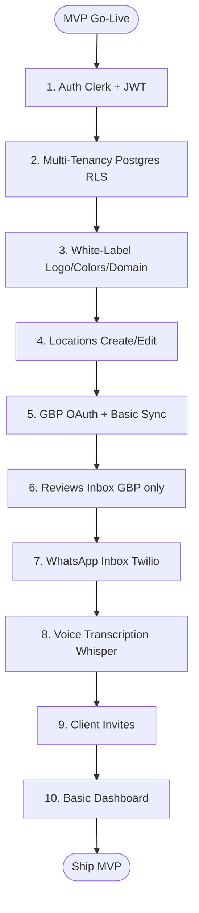

# **FARO Feature Catalog: Complete Strategic Breakdown**

## **Executive Summary**

This document categorizes FARO features by:

* **User Type:** Agency vs SMB  
* **Priority:** Critical (P0) → Nice-to-Have (P3)  
* **Implementation Phase:** MVP → Year 2+  
* **Acceptance Criteria:** What “done” looks like  
   Untitled document

## **Feature Classification Framework**

| Level | Definition | Build Timeline | Example |
| ----- | ----- | ----- | ----- |
| **P0 — Critical** | Without this, the product doesn’t work | Months 1–3 (MVP) | Auth, Multi-tenancy, WhatsApp inbox |
| **P1 — High Value** | Directly drives revenue/retention | Months 4–6 | IG/FB DMs, AI replies, GBP sync |
| **P2 — Important** | Competitive advantage, retention driver | Months 7–12 | Booking, Chatbot, E-commerce |
| **P3 — Nice-to-Have** | Enhancement, not critical | Months 13–18+ | Competitor spy, Mobile app |
| **DROP** | Low ROI / distraction / out-of-scope | Never | Video replies, LinkedIn (Y1–Y2) Untitled document |

---

## **Part 1: Feature Catalog**

### **Agency Features**

#### **A1. Multi-Tenant Platform (Agency Hierarchy)**

**Who:** Agencies  
**Priority:** P0 — Critical

**Description**

* Three-level hierarchy: **Agency → Client (SMB) → Locations**  
* **Row-Level Security (RLS)**: Agency A cannot see Agency B’s data  
* **RBAC roles:** Owner, Admin, Manager, Staff, Client Viewer  
* Tier-gated SMB client accounts (Starter=15, Growth=50, Scale=200)

**Why Critical**

* No multi-tenancy \= agencies can’t manage multiple clients  
* Data leak risk \= lawsuit \+ reputation damage \+ immediate churn

**Acceptance Criteria**

* Agency can create client accounts within tier limits  
* Agency staff can access all clients; SMB clients only see their own data  
* RLS enforced by `agency_id` filtering at SQL layer  
* Zero data leaks in penetration testing  
* Owner can assign roles; Admin manages users; Staff has limited permissions  
* Client login shows only their locations  
   Untitled document

---

#### **A2. White-Label Branding**

**Who:** Agencies  
**Priority:** P0 — Critical

**Description**

* Upload logo (PNG/SVG)  
* Set primary \+ secondary brand colors  
* Custom domain (CNAME \+ Cloudflare)  
* Remove “Powered by Faro” badge (Growth+)  
* Custom email domain for system emails  
* White-label login page

**Why Critical**

* Agencies must present Faro as **their platform** to justify retainers

**Acceptance Criteria**

* Logo appears across UI/login/emails within 30s  
* Colors update UI elements in real-time  
* Custom domain provisions SSL within 24h  
* Faro branding hidden on eligible tiers  
* Mobile responsive branding  
   Untitled document

---

#### **A3. Agency Dashboard (Rollup Metrics)**

**Who:** Agencies  
**Priority:** P1 — High Value

**Description**

* Rollup KPIs across all clients (locations, conversations, reviews, avg rating, attributed revenue)  
* Churn watch \+ health scores  
* Alerts for unanswered messages, negative reviews, sync errors

**Acceptance Criteria**

* Loads \<2s for 50 clients / 500 locations  
* Drill-down from “Needs Attention” to exact issues  
* Filters: client, date range, location  
* Export to PDF  
   Untitled document

---

#### **A4. Client Invites & User Management**

**Who:** Agencies  
**Priority:** P0 — Critical

**Description**

* Create client accounts and invite users securely  
* Client sets password (or SSO)  
* Agency manages client permissions

**Acceptance Criteria**

* Invite email sent within 60s  
* Invite expires after 7 days  
* Agency can revoke access immediately  
* Tier-enforced client user limits  
   Untitled document

---

#### **A5. White-Label Reports (PDF Export)**

**Who:** Agencies  
**Priority:** P1 — High Value

**Description**

* Monthly agency-branded performance reports  
* Snapshot audit report (on-demand, wallet-charged)  
* Download \+ scheduled email delivery

**Acceptance Criteria**

* PDF generated \<10s per location/month  
* Branding applied automatically  
* Metrics match dashboard (no discrepancies)  
* Scheduled delivery (e.g., Mondays 9 AM)  
   Untitled document

---

#### **A6. API Access & Webhooks**

**Who:** Agencies (Scale tier)  
**Priority:** P2 — Important

**Description**

* REST API for locations, conversations, reviews  
* Webhooks: `conversation.new`, `review.new`, `lead.converted`, `sync.failed`  
* API key management \+ rate limits  
* OpenAPI docs \+ code examples

**Acceptance Criteria**

* API p95 \<200ms  
* Webhooks fire within 5s  
* Rate limiting enforced (429)  
* Sandbox webhook testing  
   Untitled document

---

#### **A7. Team Collaboration (Shared Inbox)**

**Who:** Agencies  
**Priority:** P1 — High Value

**Description**

* Assign conversations  
* Internal notes \+ @mentions  
* Status tracking (Open/In Progress/Resolved)  
* Collision detection

**Acceptance Criteria**

* Assignment notifies assignee (email \+ in-app)  
* Notes never leak to customer  
* Real-time collision warnings  
* Inbox filters: assigned to me / unassigned / all  
   Untitled document

---

#### **A8. Usage & Billing Dashboard**

**Who:** Agencies  
**Priority:** P0 — Critical

**Description**

* Tier \+ billing management  
* Per-location charges  
* Usage wallet \+ breakdown \+ auto-reload  
* Invoice history \+ client resale tracking

**Acceptance Criteria**

* Wallet updates within 60s of usage  
* Drill-down costs (e.g., WhatsApp message counts × unit price)  
* Auto-reload triggers under threshold \+ sends receipt  
* PDF invoices downloadable  
   Untitled document

---

### **SMB (Location) Features**

#### **S1. Google Business Profile (GBP) Sync**

**Who:** SMBs (via agency)  
**Priority:** P0 — Critical

**Description**

* OAuth connection  
* Two-way sync (NAP, hours, categories, photos, website)  
* Sync status dashboard \+ timestamps  
* Bulk operations (Scale tier)

**Acceptance Criteria**

* OAuth done in \<3 clicks  
* Sync completes within 60s (single location)  
* Changes live in Google within 5 minutes  
* Clear error handling \+ photo quality preserved  
* Bulk update 50 locations \<2 min  
   Untitled document

---

#### **S2. Reviews Management (Monitor \+ Respond)**

**Who:** SMBs (via agency)  
**Priority:** P0 — Critical

**Description**

* Aggregate reviews (Google, Facebook; Yelp/TripAdvisor later)  
* Filterable review inbox  
* Reply publishing from Faro  
* AI reply suggestions \+ sentiment tagging  
* Alerts for new / low-star reviews

**Acceptance Criteria**

* New reviews appear \<5 min  
* AI generates 3 replies \<3s  
* Publish reply \<30s  
* Sentiment accuracy ≥85%  
* Alerts for 1–2 star reviews  
   Untitled document

---

#### **S3. Unified Inbox (Omni-Channel Conversations)**

**Who:** SMBs (via agency)  
**Priority:** P0 — Critical

**Channels**

* WhatsApp Business (Twilio → 360dialog)  
* Instagram DMs (Meta)  
* Facebook Messenger (Meta)  
* Google Business Messages (Google)  
* Email (SendGrid/SMTP)  
* Website chat widget

**Acceptance Criteria**

* Message ingest latency \<5s  
* Reply send latency \<2s  
* Cross-channel thread merging (IG → WhatsApp)  
* Voice auto-transcribed within 10s  
* Rich media fast \+ searchable conversations  
   Untitled document

---

#### **S4. WhatsApp Voice Message Transcription**

**Who:** SMBs (via agency)  
**Priority:** P0 — Critical (LATAM)

**Description**

* Auto-transcribe WhatsApp voice notes (Whisper)  
* Language detection (ES/PT/EN)  
* Transcripts indexed for search  
* Cost tracked in usage dashboard

**Acceptance Criteria**

* Transcribed \<10s  
* Accuracy ≥90% (clear audio)  
* Audio still playable  
* Search works on transcript text  
   Untitled document

---

#### **S5. Lead Management (Conversation → Revenue)**

**Who:** SMBs (via agency)  
**Priority:** P1 — High Value

**Description**

* “Mark as Lead” from conversation  
* Lead pipeline stages \+ revenue tracking  
* Source attribution from conversation/post  
* Export CSV

**Acceptance Criteria**

* Lead created \<2s and appears immediately  
* Attribution rolls up correctly  
* Notifications on key stage changes  
   Untitled document

---

#### **S6. Review Request Campaigns**

**Who:** SMBs (via agency)  
**Priority:** P1 — High Value

**Description**

* Manual request from conversation  
* Automated campaigns (e.g., 3 days post-service)  
* Review gate (unhappy → private feedback)  
* QR code generator for signage

**Acceptance Criteria**

* Manual send \<60s  
* Automated sends on schedule  
* Review gate routing correct  
* QR downloads as PNG/SVG and prints clearly  
* Conversion tracking (requests → reviews)  
   Untitled document

---

#### **S7. AI Reply Suggestions**

**Who:** SMBs (via agency)  
**Priority:** P1 — High Value

**Description**

* Generates 3 reply options (formal / friendly / short)  
* Context-aware (history, business type)  
* Review-specific templates (5-star / 3-star / 1-star)  
* Editable \+ feedback loop (thumbs up/down)

**Acceptance Criteria**

* 3 options \<3s  
* Options meaningfully distinct  
* Editable before sending  
* Usefulness ≥85% (agent survey)  
   Untitled document

---

#### **S8. Local Visibility Score & Snapshot Report**

**Who:** SMBs (via agency)  
**Priority:** P1 — High Value

**Description**

* Visibility score (0–100) based on weighted components  
* Competitor-benchmarked  
* Snapshot report (PDF) charged via wallet

**Acceptance Criteria**

* Score calculated \<5s  
* PDF report \<10s  
* Competitor data validated  
* Recommendations specific (not generic)  
   Untitled document

---

#### **S9. Appointment Booking & Calendar Sync**

**Who:** SMBs (via agency)  
**Priority:** P2 — Important

**Description**

* Google Calendar / Calendly sync  
* WhatsApp booking flow \+ reminders  
* No-show tracking

**Acceptance Criteria**

* Calendar sync \<30s  
* No double-booking  
* Reminder sent exactly 24h before  
* No-show reduction ≥50% in pilot  
   Untitled document

---

#### **S10. AI Chatbot (Auto-Respond FAQs)**

**Who:** SMBs (via agency)  
**Priority:** P2 — Important

**Description**

* Pre-configured FAQ flows (hours, pricing, location, delivery)  
* Custom flows configurable by agency  
* Escalation to human  
* Auto-resolution analytics

**Acceptance Criteria**

* Responds \<3s  
* Auto-resolve ≥60% for common FAQs  
* Escalate when confidence \<70%  
* New FAQ added via UI \<5 min  
* “hours saved” dashboard metrics  
   Untitled document

---

#### **S11. Social Media Post Attribution (ROI Tracking)**

**Who:** SMBs (via agency)  
**Priority:** P2 — Important

**Description**

* Ingest IG/FB posts, store metadata  
* Track engagement every 6 hours  
* Attribute DMs → posts → revenue  
* Top posts dashboard \+ CSV export

**Acceptance Criteria**

* Post→conversation linkage works (webhook `post_id`)  
* Metrics update every 6 hours  
* Revenue attribution manually verifiable for samples  
   Untitled document

---

#### **S12. E-Commerce Features (Shopify/WooCommerce Sync)**

**Who:** SMBs (E-Commerce ICP)  
**Priority:** P2 — Important

**Description**

* Product sync  
* Social shopping \+ WhatsApp product catalog  
* Payment links \+ order tracking  
* Cart abandonment recovery

**Acceptance Criteria**

* Initial product sync \<5 min  
* Inventory updates within 1 hour  
* Abandonment recovery sends exactly 1 hour later  
* ≥8% cart recovery conversion in test  
   Untitled document

---

#### **S13. Multi-Language Support & Auto-Translation**

**Who:** SMBs (LATAM \+ multi-national)  
**Priority:** P2 — Important

**Description**

* UI localization (ES/PT/EN)  
* Auto-translate conversations (agent sees original \+ translated)  
* Manual override

**Acceptance Criteria**

* 100% strings localized (no leaks)  
* Translation accuracy ≥85%  
* Latency \<2s  
   Untitled document

---

## **Features to Drop (Low ROI / Out-of-Scope)**

* **D1. Video Replies (Loom-style):** gimmick \+ high storage cost → **Never build**  
* **D2. LinkedIn Messages (Year 1–2):** wrong ICP \+ API friction → revisit later  
* **D3. TikTok Messages (Year 1):** API beta \+ compliance \+ low volume → revisit later  
* **D4. Full Social Scheduling:** crowded market \+ scope blowup → only basic GBP scheduling later  
* **D5. Built-in CRM:** too big; integrate instead (API/webhooks)  
   Untitled document

---

## **Diagrams (Mermaid)**

### **Multi-Tenancy Hierarchy**

(Three-level hierarchy described in A1.)

Untitled document

---

### **Omni-Channel Inbox Integrations**

(Channels listed under S3.)

Untitled document

---

### **18-Month Roadmap (Gantt)**

(Adapted from the roadmap chart in the doc.)

Untitled document

---

### **Feature Prioritization Matrix (Impact vs Effort)**

(Items reflect the matrix shown in the doc.)

Untitled document

---

### **Critical Path — MVP “Go Live” Requirements**

(Directly based on the “Critical Path” list.)

Untitled document

---

### **Feature Decision Framework (Build vs Drop)**

(Adapted from the decision tree layout.)
